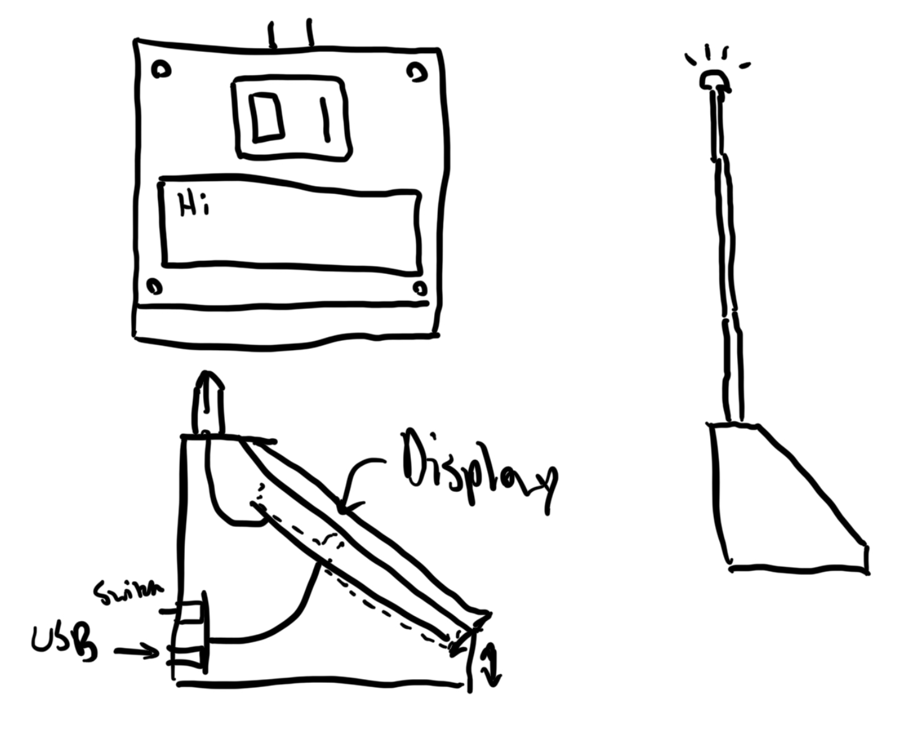

# Beacons Design Doc

- **DRI**: @ImTheSquid

## Objective

Increasing project discoverability and social interaction outside of traditional groups at Hack Night.

## Background

### Problem

Hack Night always has something interesting going on, but it’s very difficult to know about projects outside of a few specific instances (mainly Checkpoints). This leads to projects being worked on by a very small group of people and lost potential social interactions and friendships that come from working on a project together. I made some of my closest friends through my work on the Sign but the Sign is a highly-discoverable, massive object that makes it easy to come up and ask me about it. Software projects are almost impossible to do this with, and I don’t think Checkpoints provides an adequate discovery experience.

### Stakeholders

All Hack Night attendees working on projects that they’d like to talk about with other people.

### Existing Solutions

- Posters at the entrance of Hack Night where people write what they’re working on
	- Too hard to maintain and keep up to date, requires buying a lot of posters
- Erasable mini-cards for projects placed next to each person
	- Hard to find these cards

### Alternative Solutions

- Fully software-based discovery system
	- Physical projects are cooler and will lead to more interaction

## Requirements

### Goals

- Make people’s projects discoverable with an easy-to-use interface
- Rechargeable batteries for portability
- Self-updates
- Know what someone is working on using either the beacon display or the web interface
- Easy construction

### Non-Goals

- Record keeping: Beacons wipe their data on reboot and the server is ephemeral per Hack Night

### Constraints

- Cheap-ish material cost for mass-producibility
- All must run the exact same software (with maybe a hardware identifier for differentiation)

## Design

### Physical:

A small device that can be taken anywhere in Hack Night and display some basic information. Each beacon’s ID will be prominently displayed on the front alongside a short description of the project being worked on. A light on an extendable pole can be used to ping a beacon from the web interface to find it at Hack Night.

### User Interface

A web interface will exist for configuring each beacon with a description of the project. I may potentially add Sign in with ID as well but not sure yet. After each Hack Night the interface will reset.

### Deployment

Each Hack Night the beacons will be left out in a prominent place. Attendees can take and configure them and set them next to their spot for the night. After Hack Night they are collected and recharged.

## Milestones

- Circuitry prototyping: Creating the circuit using a breadboard, will take a few weeks
- Full hardware design: Creating the final PCB and the CAD for the device, will take a month
- Final prototype assembly: Putting everything together and debugging, will take a few weeks
- Software: Writing the web interface, already in progress and will take a week

## Additional Considerations

### Security

I may add a Sign In with ID functionality to prevent people from stealing beacons from each other but I don’t foresee that being a big issue so it’s a low-priority item and may not ship at MVP.

### Performance

The hardware will use a Rust-based firmware for performance.

### Maintenance

Someone will need to be assigned to charge the beacons after each Hack Night and the Wi-Fi credentials will need to be kept up to date (only happens once every four years).
