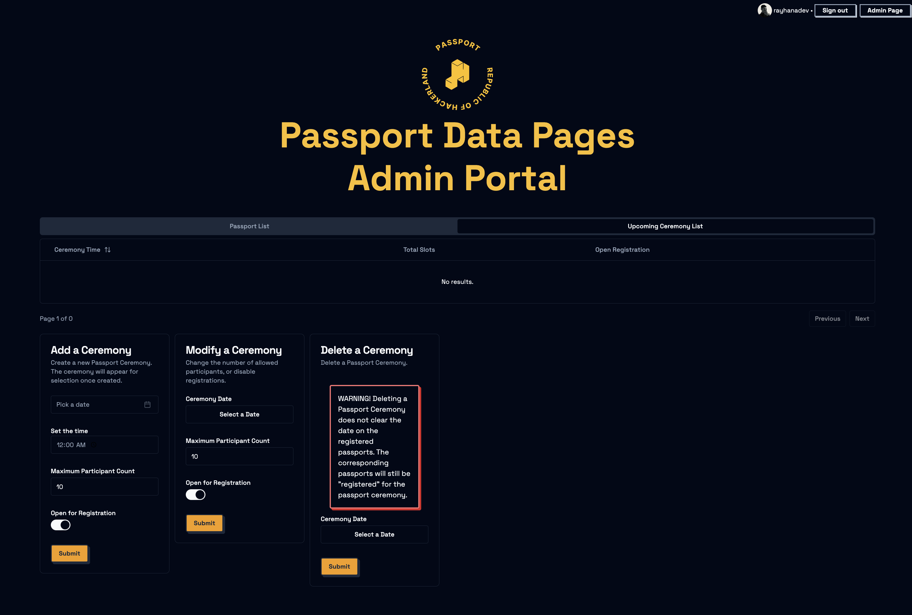

# Passport Ceremonies

Passport ceremonies are typically a ~1 hour event where approximately 10 people will create a passport during
[Hack Night](../hack-night/README.md). This event takes the place of a [Session](../hack-night/sessions/README.md)
every two weeks. See [Passports](../../engineering/passports/README.md) for more information about the physical
passport.

## Preparation

Two weeks before the event, make [an announcement](https://discord.com/channels/772576325897945119/809620019792707594/1283602036683837546)
in the Discord server to let everyone know that the Passport Ceremony will be happening at the next Hack Night!

Add a new ceremony date that is scheduled for the next Hack Night on the [Passports Issuing Office](https://passports.purduehackers.com/admin)
and ensure that the date is visible on the [Passports](https://passports.purduehackers.com) website. Note, you
will need to be an admin Passport holder to access the admin page (see [Passports](../../engineering/passports/README.md).

To prepare materials for a passport ceremony, reference [Prep](./prep.md).This should be done after you get the target
number of participants for the event. Be mindful to do this well before the event, ideally two-three days before.

## Day of Event

Ensure that all materials for the Passport Ceremony are placed in the [Hack Cart](../hack-night/hack-cart.md) prior
to Hack Night starting. The organizer bringing the Hack Cart should ensure the Passport materials are in the cart.

### Setup

Follow the steps in [Setup](./setup.md) to set up the kitchen and the stations for the event.

### During the Event

Gather all participants at 10:00 PM to start the event. Explain to them the process of creating a passport and
pass around a few demo passports to show them what they will be creating.

Provide them with their passport bundles and follow the steps in [Event](./event.md) to guide them through the
process of creating their passport. Individuals will be working at their own pace, so ensure that organizers
are available to help participants at each station.

### After the Event

Ensure that everyone's passport has been activated. If not, follow the steps in [Event#Activation](./event.md) to activate
the passport. Once all passports have been activated, place them under a heavy surface (e.g. some books) and tell
participants to wait for one hour (or until they leave).

Ensure all passports are retrieved before the end of the night. If a participant leaves their passport behind, place it
on the Hack Cart for them to pick up at a later date.

Follow the steps in [Cleanup](./cleanup.md) to clean up the kitchen and the stations after the event.
