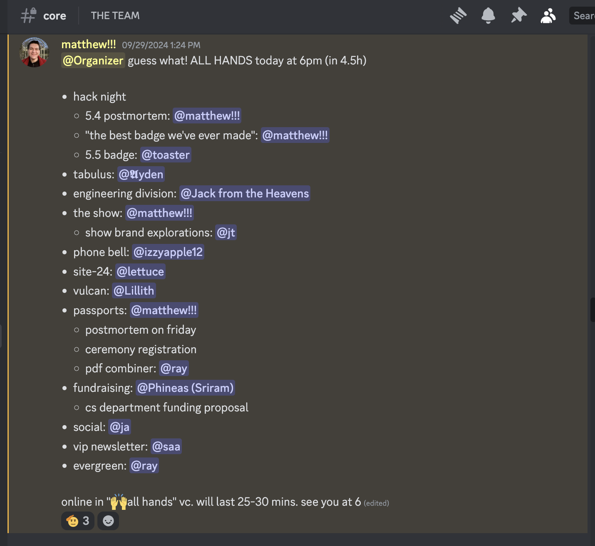
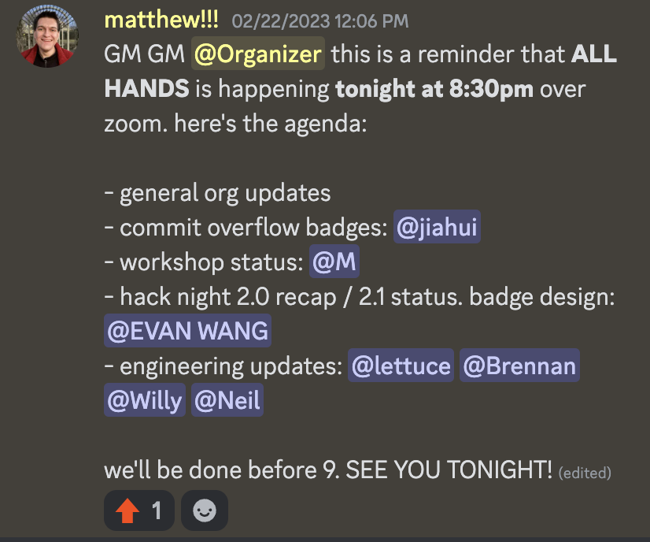
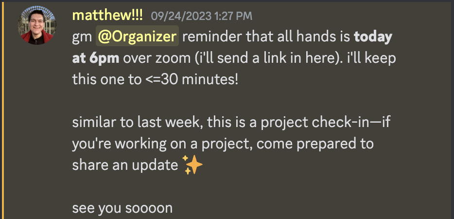
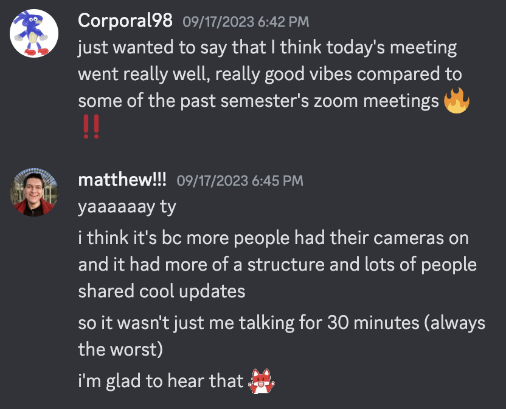
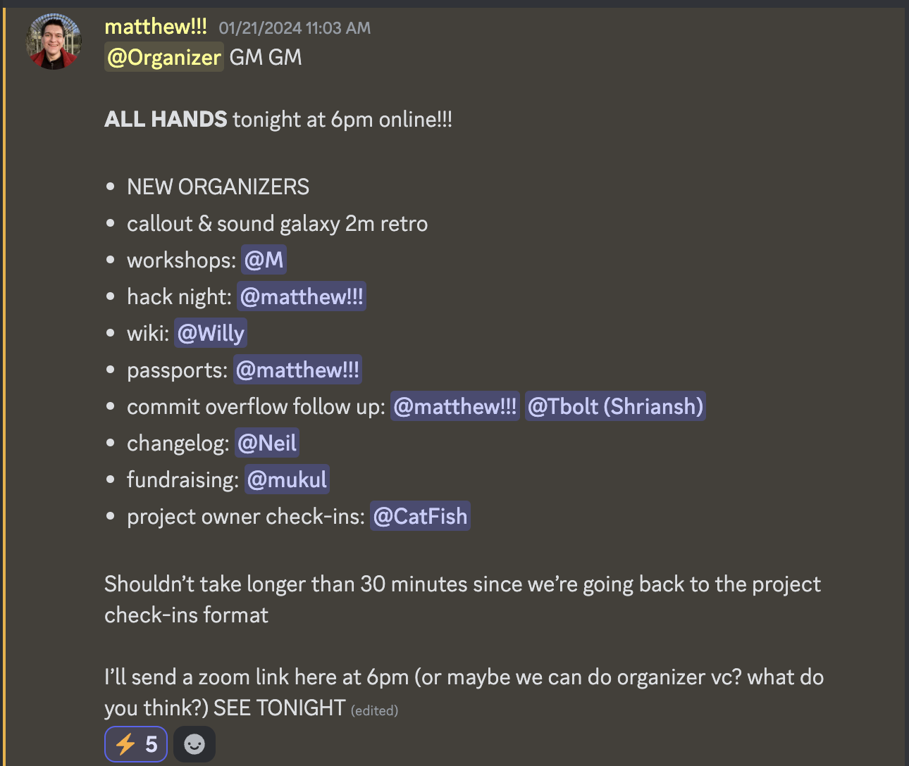
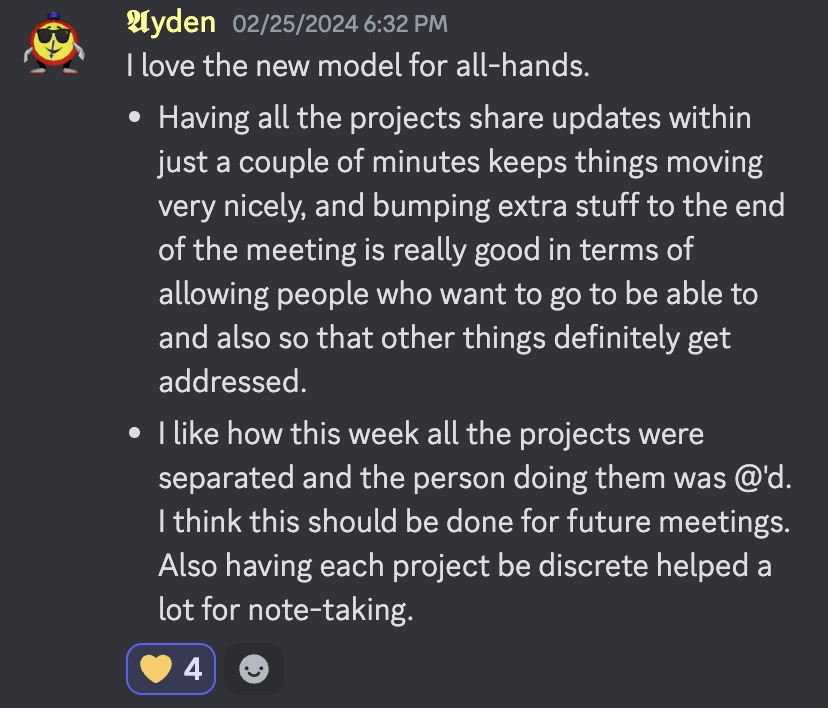

_Originally written by Matthew Stanciu on October 15th, 2024_

“All Hands” is what we call the weekly meeting for organizers. As of Fall 2024, here’s how it works.

# What is All Hands?

All Hands is a check-in meeting for active projects. Every project owner has 2 minutes to share a short update on the status of their project: 1) What happened in the last week/how the project is going overall, and 2) What’s happening next week. All Hands lasts 30 minutes.

The goal of All Hands is 1) for every organizer to be on the same page about what’s happening across the org, and 2) to serve as a weekly check-in point for project owners. All Hands should feel (& genuinely be) useful for every organizer, and should not waste time.

Attendance is strictly enforced: not showing up to All Hands without saying anything is a mortal sin, especially if you’re on the agenda. If an organizer absolutely cannot come, they need to say so ahead of time, with a non-vague reason why, and there are very few valid reasons to not come to All Hands. Scheduling something over All Hands is also a mortal sin.

All Hands is not a discussion meeting. Some light discussion/questions are allowed, but in general discussions should be had after All Hands or asynchronously over Discord. Everything shared in All Hands should be evaluated by the question, “Is this relevant to every organizer?” Every time we feel like we’re getting into the weeds about a particular project, we note that more discussion is needed on that topic and move on.

After the core All Hands meeting, we come back to the list of topics that need more discussion, and anyone who wants to participate in any those discussions sticks around. Most organizers tend to leave at this point, with 0-5 sticking around, depending on what’s on the post–All Hands agenda.

It should be noted that this description of All Hands is more of an ideal. Some All Hands do follow this format exactly, but more often than not, All Hands runs 5-10 minutes overtime, often because we get into the weeds about Hack Night or Passports. However, when this happens, I consider it a failure.

# Why All Hands?

All Hands is the only point during the week where every organizer hears everything that’s going on in the org. This is particularly important for Purdue Hackers because we have lots of ongoing projects—12, at the time of writing—which is a very large scope, larger than many other student orgs. If you’re not deeply plugged into Purdue Hackers at every moment, you will miss some of what’s going on. All Hands is the point at which everyone can get back on the same page.

Project owners also need constant check-in, feedback, and goals. All Hands provides a built-in point for this to happen. It also serves as a built-in weekly deadline: if you’re working on something, and know you will share an update at All Hands, this deadline serves as motivation.

## Why is attendance so strictly enforced?

Missing one All Hands means you go two weeks without seeing all your teammates and being on the same page with them about everything Purdue Hackers is doing. Missing two All Hands means you go three weeks without this. When you’re not on the same page, it’s hard to stay engaged at the level you need to be in order to do your best work.

I saw the following so many times during my time running Purdue Hackers before strictly enforcing attendance: Somebody missed an All Hands. I didn’t follow up, then they missed then another one. Purdue Hackers rapidly moved on without them, and they lost touch with what’s going on. As a result, they became less engaged with their work, which made them less excited to come to All Hands. So they skipped another one, became less engaged, and so on. Eventually, months later, they became dead weight on the team: not having contributed anything, and not understanding what their roles or expectations are. Every person who fell into this doom loop quit or was fired.

You can chalk this up to poor leadership—shouldn’t I, or a division lead, step in to clarify someone’s role and fill them in if they lose clarity on their expectations? But I think this would be wasted effort: everyone in a position of leadership, from project owners to division leads to me, has enough on their plate without chasing down folks to provide context they can get by coming to All Hands. Good leadership is important, but teammates have to do their part as well. (Of course, there are many reasons someone can lose context/motivation/etc that do require leaders to step in—this section is only referring to the broader team context gained from All Hands)

It also sucks for the people who do show up. All Hands is meant to be an energizing moment of the week, where everybody sees each other, hears about their work, and gets excited for the future. If folks don’t show up, the team cannot all be on the same page, and All Hands loses its purpose and value. Everyone suffers.

So. Come to All Hands every week. In exchange, it will be worth your time every week.

## Why is All Hands not a discussion meeting?

Many other student orgs have weekly officer meetings which serve as planning meetings. These meetings often run 1-2 hours, and the goal is also for everyone to be on the same page about the org’s goals.

Purdue Hackers ran meetings in this format before my time, and they were awful. The vast majority of discussions were only relevant to a small subset of attendees, leaving everyone else disengaged; and meetings dramatically lost focus after ~30 minutes. And, of course, most organizers didn’t show up, because why would you when showing up entails spending an hour in a draining meeting that provides no value?

Part of the social contract of All Hands is that, in exchange for your time, you feel like your time was well-spent. So All Hands is a tight ship, and its contents should be relevant to everyone. 30 minutes, strictly project check-ins.

(It should again be noted that All Hands does not always succeed at this goal. It’s not perfect. But this is the goal.)

# When

All Hands runs every Sunday at 6pm. The goal is for it to last 30 minutes, but most of the time it runs 5-10 minutes over.

Early on during my leadership (2022-23), I sent out a when2meet and chose the time that worked best for most people. This meant All Hands happened sometime during the week, usually between Monday and Thursday. I stopped doing this because there would be entire weeks with very poor attendance because a CS class had a midterm, and half of the organizers were in that class. I don’t remember when it became Sunday at 6pm—I actually think it might have been a happy result of a when2meet—but I’ve found it to be a much better time because there are almost never any hard commitments that take priority over All Hands, so it’s much more common for everyone to show up.

I, personally, strongly believe All Hands should run on a weekend, Saturday or Sunday. Evening classes and midterms should not be something that tanks attendance. Eliminate as many reasons to not show up as possible.

# Where

All Hands typically runs on Discord, in a voice channel called “🙌all hands”. This voice channel is public because All Hands is open to the public: anyone in the community is welcome & encouraged to join.

The first All Hands of every month runs in person in the Lawson building. We do not reserve rooms because Purdue charges us to reserve rooms over the weekend. Instead, we take advantage of the fact that Lawson is locked over the weekend and most rooms are empty, so we can run in and grab one. We usually grab LWSN 1106 or LWSN B134.

After in-person All Hands I invite everyone to dinner who wants to, making it clear that nobody has to. Typically 5-6 people come to this dinner.

## Why do we do it this way?

Most All Hands are online because All Hands is meant to be a 30 minute/week commitment. Running it in person means it suddenly becomes an hour-long commitment because of commuting back and forth. Given the goal of All Hands, I think 1 hour is too much time to commit to, and I care that All Hands feels like it’s worth the time of those who come.

That said, online meetings can be somewhat antisocial/dehumanizing/etc — or, rather, you lose a level of connection with others if you only ever see them online. Especially on Discord, which has less of a “camera-on” culture. Many of us learned this in 2020. So All Hands runs in-person once per month. These in-person All Hands are no different from the ones that run online, except for the fact that they run in person in Lawson. The goal is to make sure we all remain humans to each other instead of Discord avatars.

# Structure

Sometime before All Hands, I ping every organizer in `#core` announcing it, its location, and an agenda along with the Discord handle of every project owner.

I also typically post something in `#lounge` informing the broader community of All Hands, its time, and location, and stressing that everyone is welcome to come.

At 5:59, I ping every organizer again reminding them to come. It’s normal for people to show up a minute or two late. If someone is more than 2 minutes late, I ping them directly and ask them where they are.

One person is asked to take notes, but we use a collaborative markdown editor that everyone is welcome to have open & add to.

All Hands typically begins around 6:03. I run through the agenda, calling out each project owner by name. For each item on the agenda, I start a stopwatch, and say “Time check” if it’s been longer than 2 minutes.

During their segment, every project owner is expected to share 1) The overall status of their project, 2) What happened last week, 3) What’s happening next week.

If it’s been longer than 2 minutes and it’s clear more discussion is needed, I add it to the list of topics to come back to. Though more often I really want to quickly finish the discussion, so we just run over by a minute 🫣.

After the agenda finishes, I thank everyone for coming. If any post–All Hands discussion items are on the list, I name them and encourage those who want to participate to stick around. Everyone else is welcome to leave. If anyone sticks around, I do as well until discussions are complete.

Whoever was asked to own meeting notes shares them in the `#meeting-notes` forum channel in Discord, in a thread titled “All Hands \<date\>”, as well as committing them to the `dark-forest` repo.

If I noticed that someone didn’t show up and didn’t inform the team ahead of time, I reach out privately asking them where they were & not to do that again.

## Past structures

### 2021-22

Weekly meetings, ~1 hour long, discussion-based. See “Why is All Hands not a discussion meeting?”

### Fall 2022

Discussion about various things going on in Purdue Hackers. Sub-team check-ins. 45 minutes, over Zoom.

Notes from a Fall 2022 meeting: https://talented-stew-2af.notion.site/09-22-2022-Meeting-Notes-abaa55ce482146a8af64442b5bc4e59c

### Spring 2023

Team structure moved to projects with DRIs instead of subteams in February 2023. All Hands started to resemble a project check-in meeting:

Announcement of a Spring ’23 All Hands

However, All Hands still lasted 45-50 minutes, and much of it was me talking. Still over Zoom.

### Fall 2023

All Hands began to take on a more strictly “project updates” approach:

Fall 2023 All Hands announcement

Fall 2023 feedback

However, All Hands still tended to last ~45 minutes.

### Spring 2024

Around late January/early February, we began adding follow-up discussions and started running All Hands over Discord.

Spring 2024 All Hands announcement

Spring 2024 All Hands announcement

This made meetings run closer to 30 minutes again.

# Misc

Personal opinion: All Hands is not “the meeting”/“a meeting”. It’s All Hands, capital-A, capital-H. I don’t enforce this on others because that would be cringe, but I personally am careful to always refer to it as All Hands.